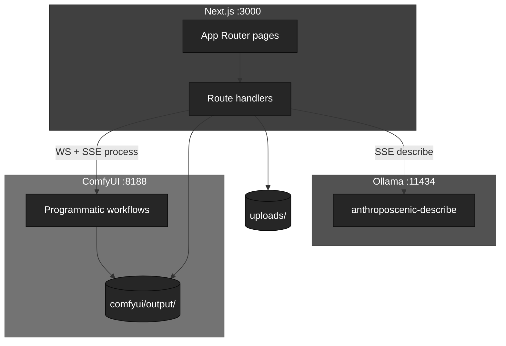

# Anthroposcenic

Local image pipeline: upload an image, generate a prompt with Ollama, configure ComfyUI settings, and render a reinterpretation.

## Stack

| Layer | Technology | Port |
|-------|------------|------|
| App | Next.js 14 (App Router), React 18, TypeScript | 3000 |
| UI | Tailwind CSS v4, ShadCN v4 (Radix Nova), Geist, Sonner | — |
| Vision / prompts | Ollama — `anthroposcenic-describe:latest` (default) | 11434 |
| Image generation | ComfyUI — Flux GGUF (default) or SD checkpoints | 8188 |
| Progress | ComfyUI WebSocket + HTTP poll; SSE to browser | — |
| Images | Sharp (upload resize), `next/image` | — |
| Storage | `./uploads`, `comfyui/output`, `data/exports` | — |



**UI flow:** `/` → `/upload` → `/describe` → `/configure` → `/process` → `/complete` · `/archive` for past renders

`npm run dev` starts **Ollama + Next.js only**. ComfyUI starts on demand when processing.

## Quick setup

**Requirements:** Node.js 18+, Python 3.10+, 16GB+ RAM, ~20GB disk for models.

```bash
git clone https://github.com/yourusername/anthroposcenic.git
cd anthroposcenic
npm install
```

**Ollama**

```bash
# macOS
brew install ollama

# Linux
curl -fsSL https://ollama.com/install.sh | sh
```

```bash
npm run ollama:modelfile   # pulls llava:7b if needed, builds anthroposcenic-describe:latest
# or: npm run ollama:models   # optional qwen3-vl:8b + modelfile step
```

**ComfyUI**

```bash
npm run comfyui:setup
npm run comfyui:flux          # Flux GGUF — default when present
# optional SD checkpoints:
npm run comfyui:download-all
```

**Run**

```bash
npm run dev
```

| Service | URL |
|---------|-----|
| App | http://localhost:3000 |
| Ollama | http://localhost:11434 |
| ComfyUI | http://localhost:8188 (on first process) |

Optional: `.env.local` — see [docs/configuration.md](docs/configuration.md).

## Documentation

| Document | Contents |
|----------|----------|
| [architecture.md](docs/architecture.md) | Pipeline, routes, streaming, storage |
| [models.md](docs/models.md) | Ollama and ComfyUI model setup |
| [configuration.md](docs/configuration.md) | Environment variables |
| [api.md](docs/api.md) | HTTP API routes |
| [scripts.md](docs/scripts.md) | `npm run` reference |
| [development.md](docs/development.md) | Project layout and key modules |
| [troubleshooting.md](docs/troubleshooting.md) | Common failures |
| [testing.md](docs/testing.md) | Manual test checklist |

## License

See [LICENSE](./LICENSE).
