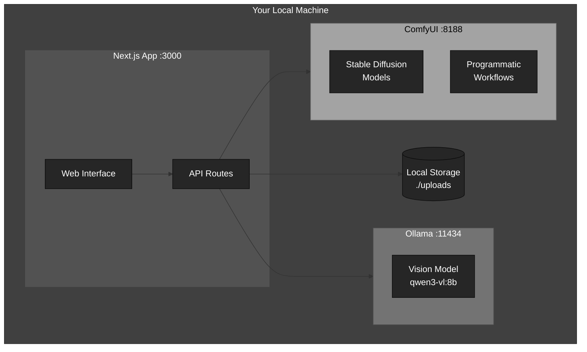
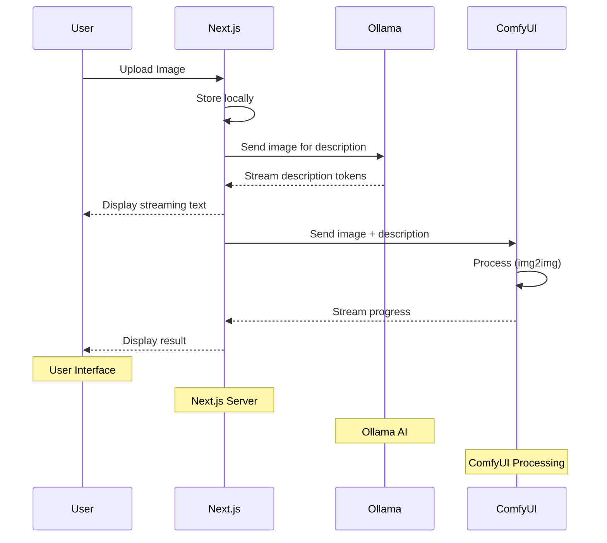
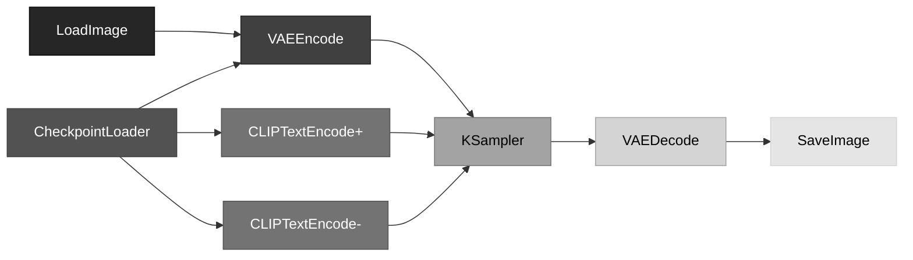

# Anthroposcenic

**A 100% local, privacy-first AI image processing pipeline.**

Upload an image → Generate AI description → Process with ComfyUI → All on your machine.


## Why Local?

- **Privacy**: Images never leave your machine
- **Free**: No API costs or rate limits  
- **Offline**: Works without internet (after setup)
- **Fast**: No network latency
- **Control**: Full customization of models and workflows

---

## Architecture



**All communication via `localhost` — zero external calls.**

---

## Quick Start

### Prerequisites

| Requirement | Version | Purpose |
|-------------|---------|---------|
| Node.js | 18+ | Next.js app |
| Python | 3.10+ | ComfyUI |
| RAM | 16GB+ | AI models |
| Storage | 20GB+ | Models & images |

### 1. Clone & Install

```bash
git clone https://github.com/yourusername/anthroposcenic.git
cd anthroposcenic
npm install
```

### 2. Install Ollama

**macOS:**
```bash
brew install ollama
```

**Linux:**
```bash
curl -fsSL https://ollama.com/install.sh | sh
```

**Windows:** Download from [ollama.com/download](https://ollama.com/download)

### 3. Install Vision Models & Create Custom Model

```bash
npm run ollama:models
```

This installs the base vision model (`llava:7b`) and creates a custom model (`anthroposcenic-describe:latest`) with an optimized system prompt for image description.

**Or manually:**
```bash
# Install base model
ollama pull llava:7b

# Create custom model with system prompt
npm run ollama:modelfile
```

The custom model includes a system prompt optimized for generating detailed image descriptions suitable for AI image generation systems.

### 4. Setup ComfyUI

```bash
npm run comfyui:setup
```

This clones ComfyUI, creates a Python venv, and installs dependencies.

### 5. Download SD Model (Required)

**Note: ComfyUI requires a Stable Diffusion checkpoint to process images.**

Download a checkpoint model to:

```
comfyui/models/checkpoints/
```

**Recommended models:**
- **Stable Diffusion 1.5** (~4GB): [Hugging Face](https://huggingface.co/runwayml/stable-diffusion-v1-5)
- **SDXL** (~7GB): [Hugging Face](https://huggingface.co/stabilityai/stable-diffusion-xl-base-1.0)
- **Community models**: [Civitai](https://civitai.com)

**File formats:** `.safetensors` or `.ckpt`

**Quick download (SD 1.5):**
```bash
cd comfyui/models/checkpoints
curl -L -o sd-v1-5.safetensors https://huggingface.co/runwayml/stable-diffusion-v1-5/resolve/main/v1-5-pruned.safetensors
```

### 6. Start Everything

```bash
npm run dev
```

This starts all services concurrently and opens your browser:

| Service | URL | Status |
|---------|-----|--------|
| Next.js | http://localhost:3000 | App |
| Ollama | http://localhost:11434 | AI |
| ComfyUI | http://localhost:8188 | Image Gen |

---

## How It Works



### Pipeline Steps

1. **Upload** — Image saved to `./uploads/`
2. **Describe** — Ollama vision model analyzes image, streams description
3. **Process** — ComfyUI runs img2img workflow with description as prompt
4. **Result** — Processed image streamed back to browser

---

## Configuration

### Environment Variables

Create `.env.local`:

```env
# Ollama (Local)
OLLAMA_HOST=http://localhost:11434
OLLAMA_MODEL=qwen3-vl:8b

# ComfyUI (Local)
COMFYUI_HOST=http://localhost:8188
# Memory optimization: --lowvram, --novram, --cpu, or --normalvram (default)
# COMFYUI_MEMORY_MODE=--lowvram

# Storage
UPLOAD_DIR=./uploads
MAX_FILE_SIZE=10485760

# Image Compression (automatic during upload)
MAX_IMAGE_WIDTH=1024      # Maximum width in pixels (preserves aspect ratio)
MAX_IMAGE_HEIGHT=1024     # Maximum height in pixels (preserves aspect ratio)
JPEG_QUALITY=85           # JPEG quality 1-100 (higher = better quality, larger file)
PNG_QUALITY=90            # PNG quality 1-100
WEBP_QUALITY=85           # WebP quality 1-100
```

### Model Configuration

Models are defined in `config/models.json`:

```json
{
  "ollama": {
    "default": "anthroposcenic-describe:latest",
    "vision": {
      "anthroposcenic-describe:latest": {
        "recommended": true,
        "baseModel": "llava:7b"
      },
      "llava:7b": { "recommended": false }
    }
  }
}
```

**Custom Model with System Prompt:**

The application uses a custom Ollama model (`anthroposcenic-describe:latest`) created from `config/ollama-modelfile`. This modelfile includes:

- **System Prompt**: Optimized for detailed image descriptions for AI image generation
- **Base Model**: `llava:7b` (fast and reliable)
- **Parameters**: Temperature 0.7, top_p 0.9, top_k 40

**Create/Update the custom model:**
```bash
npm run ollama:modelfile
```

**Install all models:**
```bash
npm run ollama:models
```

**Edit the system prompt:**
Edit `config/ollama-modelfile` and recreate the model:
```bash
npm run ollama:modelfile
```

**Modelfile Structure:**

The `config/ollama-modelfile` defines the custom model:

```dockerfile
FROM llava:7b

SYSTEM """You are an expert image analysis assistant...
[System prompt for detailed image descriptions]
"""

PARAMETER temperature 0.7
PARAMETER top_p 0.9
PARAMETER top_k 40
```

You can customize:
- **FROM**: Base model (e.g., `llava:7b`, `llava:13b`, `qwen3-vl:8b`)
- **SYSTEM**: System prompt that guides the model's behavior
- **PARAMETER**: Generation parameters (temperature, top_p, top_k)

After editing, recreate the model:
```bash
npm run ollama:modelfile
```

---

## Project Structure

```
├── app/
│   ├── api/
│   │   ├── upload/          # Image upload
│   │   ├── describe/        # Ollama streaming
│   │   ├── comfyui/         # ComfyUI processing
│   │   └── models/          # Model list
│   └── page.tsx             # Main UI
├── components/
│   ├── ui/                  # ShadCN components
│   ├── ImageUploadZone.tsx
│   ├── DescriptionStream.tsx
│   └── ComfyUIProgress.tsx
├── lib/
│   ├── ollama.ts            # Ollama client
│   ├── comfyui.ts           # ComfyUI client + workflow
│   └── models.ts            # Model utilities
├── comfyui/                 # ComfyUI installation
├── config/
│   ├── models.json          # Model definitions
│   └── ollama-modelfile     # Custom Ollama model with system prompt
└── scripts/
    ├── start-ollama.sh
    ├── start-comfyui.sh
    └── setup-comfyui.sh
```

---

## ComfyUI Workflow

The workflow is built **programmatically in code** — no UI required.



Customize in `lib/comfyui.ts`:

```typescript
createComfyUIWorkflow(imageFilename, description, {
  checkpoint: 'model.safetensors',
  steps: 30,
  cfgScale: 8.0,
  denoiseStrength: 0.6,
})
```

---

## API Reference

| Endpoint | Method | Description |
|----------|--------|-------------|
| `/api/upload` | POST | Upload image, returns `imageId` |
| `/api/describe` | POST | Stream description from Ollama |
| `/api/comfyui/process` | POST | Process with ComfyUI |
| `/api/images/[id]` | GET | Retrieve uploaded image |
| `/api/models` | GET | List available models |

---

## Scripts

| Command | Description |
|---------|-------------|
| `npm run dev` | Start all services + open browser |
| `npm run dev:next` | Start Next.js only |
| `npm run dev:ollama` | Start Ollama only |
| `npm run dev:comfyui` | Start ComfyUI only |
| `npm run comfyui:setup` | Install ComfyUI |
| `npm run comfyui:test-memory` | Test ComfyUI memory modes to find optimal settings |
| `npm run ollama:models` | Install recommended models + create custom model |
| `npm run ollama:modelfile` | Create/update custom model from modelfile |
| `npm run ollama:check` | Verify Ollama status |

---

## Troubleshooting

### Service Won't Start

```bash
# Check what's using ports
lsof -i :3000   # Next.js
lsof -i :11434  # Ollama
lsof -i :8188   # ComfyUI

# Kill stuck processes
pkill ollama
pkill -f "python.*main.py"
```

### Ollama Model Not Found

```bash
ollama list              # See installed models
ollama pull qwen3-vl:8b  # Re-download
```

### ComfyUI Processing Timeout / No Checkpoints

**Error:** `No checkpoint models available` or `ckpt_name: '' not in []`

**Solution:** Install a Stable Diffusion checkpoint:

```bash
# Navigate to checkpoints directory
cd comfyui/models/checkpoints

# Download SD 1.5 (recommended, ~4GB)
curl -L -o sd-v1-5.safetensors \
  https://huggingface.co/runwayml/stable-diffusion-v1-5/resolve/main/v1-5-pruned.safetensors

# Verify it's there
ls -lh *.safetensors *.ckpt
```

**After installing:** Restart ComfyUI or the app will auto-detect on next request.

### ComfyUI Python Errors

```bash
cd comfyui
./venv/bin/pip install -r requirements.txt
```

### Out of Memory

**ComfyUI Memory Optimization:**

ComfyUI supports several memory optimization modes. Test which works best for your system:

```bash
# Run the memory testing script
./scripts/test-comfyui-memory.sh
```

**Available Memory Modes:**

1. **`--normalvram`** - Normal VRAM usage (requires CUDA/GPU, not available on macOS)
2. **`--lowvram`** - Reduced VRAM usage (requires CUDA/GPU, not available on macOS)
3. **`--novram`** - Use CPU instead of GPU (requires CUDA initialization, not available on macOS)
4. **`--cpu`** - Force CPU mode (✅ **Required on macOS** - auto-enabled by default)

**Note for macOS users:** Since PyTorch is installed with CPU-only support, you must use `--cpu` mode. The startup scripts automatically detect macOS and use `--cpu` mode with `--use-split-cross-attention` for optimal memory usage.

**To use a specific mode:**

Set the `COMFYUI_MEMORY_MODE` environment variable:

```bash
# In your terminal
export COMFYUI_MEMORY_MODE=--lowvram
npm run dev:comfyui
```

Or add to `.env.local`:

```env
COMFYUI_MEMORY_MODE=--lowvram
```

**Other Memory Tips:**

- Use smaller models: `llava:7b` instead of `qwen3-vl:8b`
- Close other applications
- Reduce ComfyUI steps/resolution in workflow options
- Use `--lowvram` if you have 4-8GB VRAM
- Use `--novram` or `--cpu` if you have limited system RAM

---

## Tech Stack

| Layer | Technology |
|-------|------------|
| Frontend | Next.js 14, React, TypeScript |
| Styling | Tailwind CSS, ShadCN UI |
| AI Description | Ollama (qwen3-vl, llava) |
| Image Processing | ComfyUI (Stable Diffusion) |
| Streaming | Server-Sent Events |

---

## Privacy Guarantee

```
┌─────────────────────────────────────────────┐
│  Images stored locally (./uploads)          │
│  AI runs on localhost:11434 (Ollama)        │
│  Processing on localhost:8188 (ComfyUI)     │
│  Zero external API calls                    │
│  No API keys required                       │
│  Works offline after setup                  │
└─────────────────────────────────────────────┘
```

**Your images never leave your machine.**

---

## License

See [LICENSE](./LICENSE) file.
