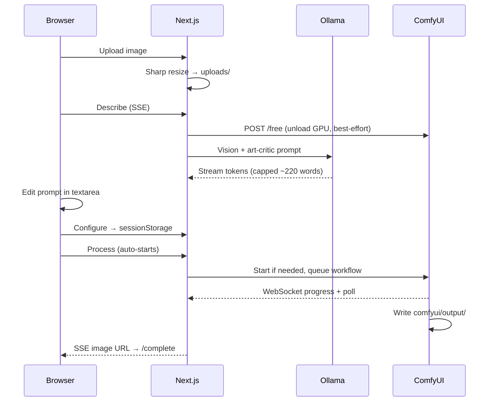

# Architecture

## Pipeline

## Steps

| Step | Route | What happens |
|------|-------|----------------|
| Upload | `/upload` | Drag/drop or pick file; Sharp compresses to max 1024px; saved as `uploads/{imageId}.{ext}` |
| Describe | `/describe` | Ollama streams a natural-language prompt (2–4 sentences + style tags); user edits before continue |
| Configure | `/configure` | Flux (Fast/Slow) or SD checkpoint, denoise, sampler, negative prompt, advanced toggles; stored in `sessionStorage` |
| Process | `/process` | Auto-runs on mount; phased progress bar; recovery poll if SSE drops |
| Complete | `/complete` | Completion message + download / archive / reinterpret |
| Archive | `/archive` | Masonry grid of `comfyui/output/anthroposcenic_*`; use, download, delete |

There is **no** separate transform step in the main UI. `/api/transform` and `CreativeTransform.tsx` exist but are not wired into the flow.

## Describe behaviour

- Default model: `anthroposcenic-describe:latest` (`FROM llava:7b` in `config/ollama-modelfile`).
- The **user prompt** in `app/api/describe/route.ts` drives output format (art-critic prose + tags), not JSON and not auto-generated ComfyUI config.
- Stream capped by `lib/prompt-limits.ts` (~220 words / 80 tags).
- Supports optional `imageIds[]` for multi-image blend prompts.
- Calls ComfyUI `/free` before Ollama to release GPU memory on Apple Silicon.

## Configure behaviour

- **Flux** (when GGUF files exist): default checkpoint; **Fast** = schnell (4 steps), **Slow** = dev (~20 steps). SD-only controls hidden.
- **SD checkpoints**: sampler, scheduler, steps, CFG, denoise, hi-res pass, ControlNet Tile, FreeU, quality tags.
- Negative prompt defaults block humans, animals, faces (editable in Advanced).

## Services

| Service | Role |
|---------|------|
| Ollama | `/api/describe` vision streaming |
| ComfyUI | `/api/comfyui/process` — started by `lib/comfyui-startup.ts` if not running |
| Next.js | Sole browser-facing API; proxies images from uploads and output |

## Storage

| Path | Purpose |
|------|---------|
| `uploads/` | Source images by `imageId` |
| `comfyui/output/` | Rendered `anthroposcenic_*.png` |
| `comfyui/input/` | Copies for ComfyUI `LoadImage` |
| `comfyui/models/` | `unet/` (Flux GGUF), `checkpoints/`, `vae/`, `clip/`, upscale, ControlNet |
| `data/exports/` | Per-run description, config, metadata (best-effort) |

## ComfyUI workflow

Built in `lib/comfyui.ts` — no ComfyUI UI required. Flux uses `UnetLoaderGGUF`; SD uses `CheckpointLoaderSimple`. Optional hi-res upscale pass, ControlNet Tile, FreeU.

Progress: `lib/comfyui-ws.ts` (WebSocket) with HTTP poll fallback; `lib/processing-progress.ts` aggregates multi-pass jobs.
