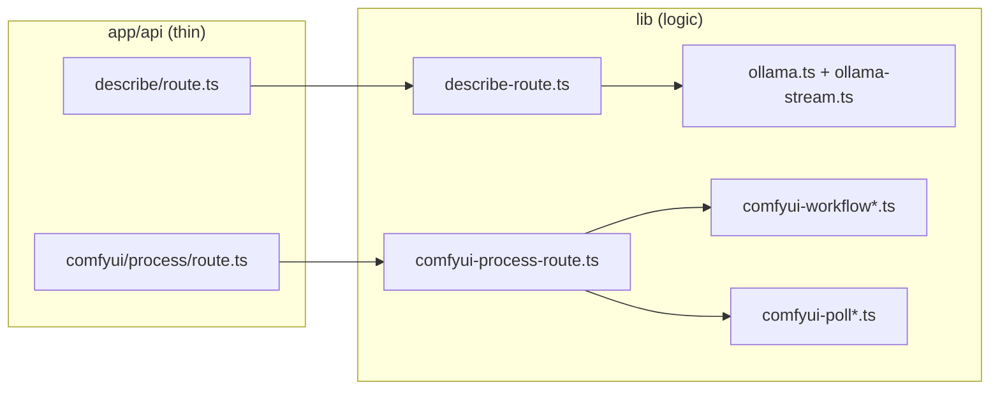

# Architecture

Anthroposcenic is a local image pipeline: upload → Ollama describe → configure ComfyUI → render → archive. The Next.js app is the only browser-facing surface; Ollama and ComfyUI run as local services.

## End-to-end flow

## UI routes

| Step | Route | What happens |
|------|-------|----------------|
| Upload | `/upload` | Drag/drop or pick file; Sharp compresses to max 1024px; saved as `uploads/{imageId}.{ext}` |
| Describe | `/describe?imageId=…` | Ollama streams a natural-language prompt (2–4 sentences + style tags); user edits before continue |
| Describe (blend) | `/describe?imageIds=a,b,…` | Multi-image fusion prompt from archive selection |
| Configure | `/configure?imageId=…` or `?mode=blend` | Flux (Fast/Slow) or SD checkpoint, denoise, sampler, negative prompt, advanced toggles |
| Process | `/process?imageId=…` or `?mode=blend` | Auto-runs on mount; phased progress bar; recovery poll if SSE drops |
| Complete | `/complete` | Completion message + download / archive / reinterpret |
| Archive | `/archive` | Grid of uploads + `comfyui/output/`; reinterpret, blend, download, delete |

There is **no** separate transform step. Configuration is manual in the configure UI.

### Pipeline state

| Data | Storage |
|------|---------|
| Prompt text | `sessionStorage` via `lib/pipeline-description.ts` |
| ComfyUI config | `sessionStorage` via `lib/pipeline-config.ts` |
| `imageId` | URL query between single-image steps |
| Blend mode | `mode=blend` query param; no source `imageId` on process (txt2img) |

Re-exports and `clearPipelineState()` live in `lib/pipeline-storage.ts`.

## Code layout

Route handlers under `app/api/` are **thin**: they create an SSE `ReadableStream` and delegate to `lib/*`. Business logic, streaming, and service integration live in `lib/`.

### Describe path

1. `app/api/describe/route.ts` → `lib/describe-route.ts` (`runDescribeStream`)
2. Load images from `uploads/` via `lib/upload-images.ts`
3. Best-effort `POST /free` on ComfyUI to release GPU before Ollama
4. `buildDescribePrompt()` sends the art-critic user message (prose + tags)
5. `lib/ollama.ts` streams from Ollama; `lib/ollama-stream.ts` parses tokens
6. `lib/prompt-limits.ts` caps output; `lib/streaming.ts` formats SSE

The describe prompt is sent entirely from `buildDescribePrompt()` in `lib/describe-route.ts` — no custom Ollama modelfile or wrapper model.

Model resolution: request `model` → `OLLAMA_MODEL` → `llava:7b` (`config/models.json` via `getDefaultOllamaModel()`).

### Process path

1. `app/api/comfyui/process/route.ts` → `lib/comfyui-process-route.ts` (`runComfyUIProcessStream`)
2. `lib/comfyui-startup.ts` starts ComfyUI if not running
3. `lib/model-downloader.ts` ensures SD checkpoints exist (Flux GGUF is setup-script only)
4. `lib/comfyui.ts` queues the workflow built by `lib/comfyui-workflow.ts`
5. `lib/comfyui-poll.ts` orchestrates WebSocket then HTTP fallback
6. `lib/processing-progress.ts` maps raw updates to phased UI progress
7. Client subscription + recovery in `lib/comfyui-process-stream.ts`

### ComfyUI workflows

Built programmatically — no ComfyUI UI required.

| Module | Role |
|--------|------|
| `lib/comfyui-workflow.ts` | Entry: `createComfyUIWorkflow()`, Flux GGUF path (`UnetLoaderGGUF`) |
| `lib/comfyui-workflow-sd.ts` | SD checkpoint path (`CheckpointLoaderSimple`), ControlNet Tile, FreeU |
| `lib/comfyui-workflow-sd-hires.ts` | SD hi-res refine pass |
| `lib/comfyui-workflow-types.ts` | Shared workflow graph types |
| `lib/comfyui-defaults.ts` | Default negative prompt and constants |

Flux uses dual CLIP + T5 and natural-language prompts. SD supports img2img or txt2img (blend mode sets `useImage: false`).

### Progress and recovery

| Layer | Module |
|-------|--------|
| WebSocket | `lib/comfyui-ws.ts`, `lib/comfyui-ws-message.ts` |
| Poll orchestration | `lib/comfyui-poll.ts` |
| WS branch | `lib/comfyui-poll-ws.ts` |
| HTTP fallback | `lib/comfyui-poll-http.ts`, `lib/comfyui-poll-api.ts`, `lib/comfyui-poll-history.ts` |
| Output detection | `lib/comfyui-poll-output.ts`, `lib/comfyui-output.ts` |
| Client SSE fan-out | `lib/comfyui-process-stream.ts` |
| Recovery endpoint | `app/api/comfyui/process/result/route.ts` |

The process stream emits `meta` with `promptId` and `jobStartTime` so the client can poll `/api/comfyui/process/result` if SSE closes early.

## Services

| Service | Port | Role |
|---------|------|------|
| Next.js | 3000 | UI + all `/api/*` routes |
| Ollama | 11434 | Vision describe streaming |
| ComfyUI | 8188 | Image generation (started on demand) |

`npm run dev` starts Ollama + Next.js only. ComfyUI starts when processing begins.

## Storage

| Path | Purpose |
|------|---------|
| `uploads/` | Source images by UUID `imageId` |
| `comfyui/output/` | Rendered `anthroposcenic_*.png` |
| `comfyui/input/` | Copies for ComfyUI `LoadImage` |
| `comfyui/models/` | `unet/` (Flux GGUF), `checkpoints/`, `vae/`, `clip/`, upscale, ControlNet |

Archive listing, safety checks, and copy-to-upload live in `lib/output-archive.ts`. Image serving uses `lib/serve-output-image.ts`.

## Configure UI

| Module | Role |
|--------|------|
| `components/ConfigSelector.tsx` | Form shell |
| `lib/use-config-selector-form.ts` | React state hook |
| `lib/config-form.ts` | Form values and Flux/SD detection |
| `lib/config-defaults.ts` | Defaults from `/api/comfyui/config` |
| `lib/config-process.ts` | Map form → `ComfyUIConfig` for process request |

Flux **Fast** / **Slow** resolves to schnell / dev GGUF filenames client-side before submit.
